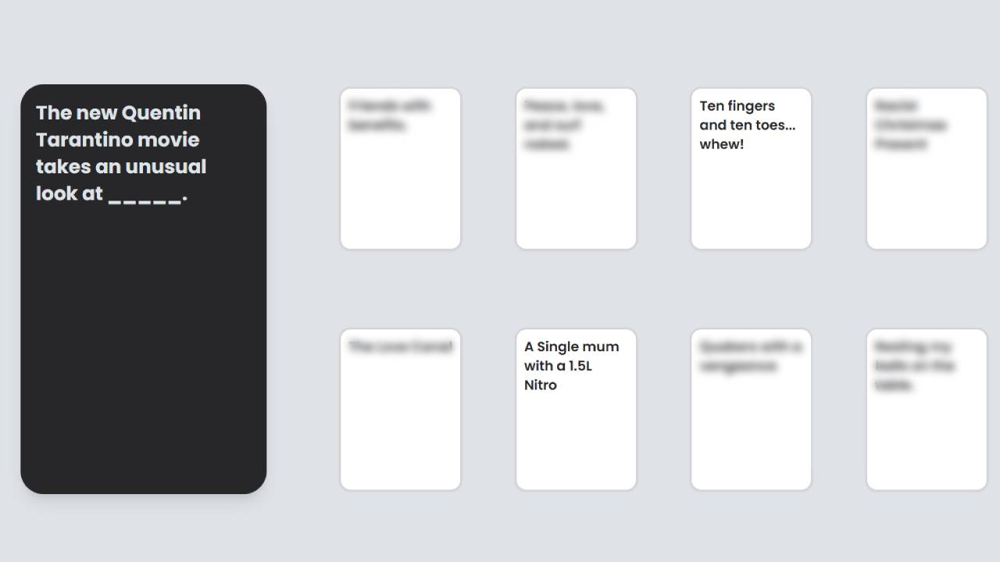

# Cards against Sapiens

[https://cards-against-sapiens.onrender.com/](https://cards-against-sapiens.onrender.com/).

A multiplayer cards against humanity clone.

Built using FastAPI and sockets running in Docker on the backend, with React and Typescript in the backend.

Link to online version can be found [here](https://cards-against-sapiens.onrender.com/). You can play it by yourself by opening multiple tabs, clicking the copy button after creating game will provide a link to the clipboard to join the same game, or you can type in the game code.

